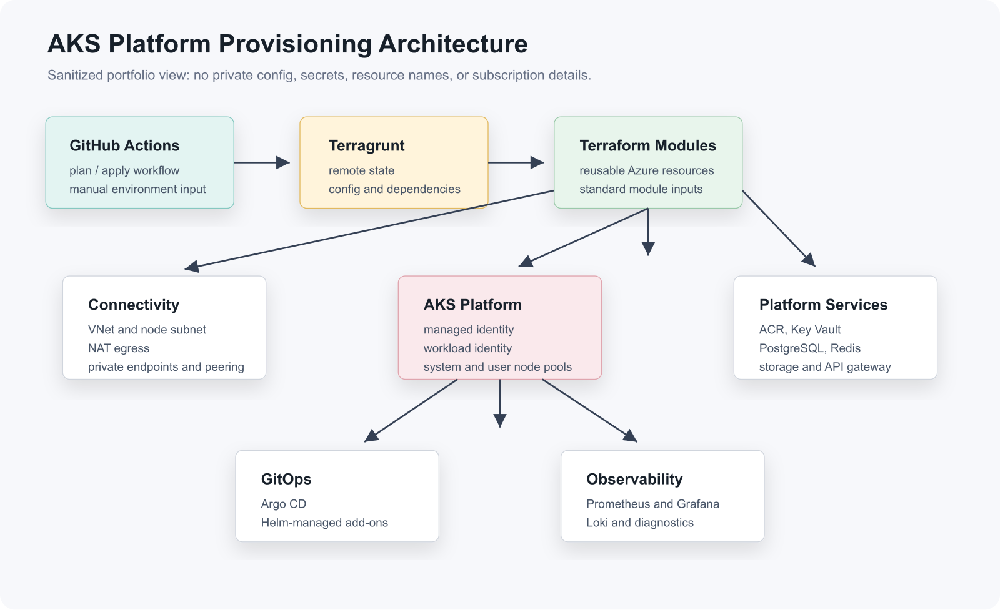

  

    
Platform Engineer | Kubernetes | Azure | AWS | Terraform | GitOps

    <h1>Mohammed Suhail</h1>
    
Building production-ready cloud platforms for teams that need reliability, speed, and operational clarity.

    
I design and operate Kubernetes platforms, infrastructure delivery workflows, ingress patterns, and observability foundations for real production systems. My focus is simple: make cloud infrastructure repeatable, secure, observable, and safe for product teams to use every day.

    

      <a class="md-button md-button--primary" href="Azure/">View AKS case study</a>
      <a class="md-button" href="ingress-controller-migration/">View ingress migration</a>
    

  

  

    
Production Signals

    
    <dl>
      
<dt>20M+</dt><dd>traffic scale supported through Kubernetes autoscaling and platform tuning</dd>

      
<dt>20+</dt><dd>microservices deployed through GitOps-style delivery workflows</dd>

      
<dt>EKS + AKS</dt><dd>production platform operations across AWS and Azure environments</dd>

      
<dt>CKA</dt><dd>Certified Kubernetes Administrator</dd>

    </dl>
  

## Platform Engineering Focus

- :simple-kubernetes:{ .lg .middle } **Kubernetes Platforms**

    EKS and AKS operations, cluster add-ons, node pool separation, ingress, autoscaling, TLS, secrets, and workload readiness.

- :material-source-branch:{ .lg .middle } **Infrastructure Delivery**

    Terraform, Terragrunt, GitHub Actions, reusable module contracts, environment config patterns, and controlled infrastructure workflows.

- :material-sync:{ .lg .middle } **GitOps and Release Flow**

    Argo CD, Helm, ApplicationSets, service onboarding patterns, and repeatable delivery for application and platform add-ons.

- :material-chart-line:{ .lg .middle } **Observability and Reliability**

    Prometheus, Grafana, Loki, endpoint checks, diagnostic settings, incident visibility, and platform feedback loops.

## Featured Case Studies

| Case study | What it demonstrates |
| --- | --- |
| [AKS Platform Provisioning](Azure/README.md) | Azure Kubernetes platform design using Terraform modules, Terragrunt orchestration, GitHub Actions, GitOps, and observability. |
| [AKS Platform Deep Dive](Azure/aks-platform-case-study.md) | How the infrastructure is composed across config, modules, resource wrappers, node pools, managed identities, private services, and diagnostics. |
| [Community NGINX to F5 NGINX Migration](ingress-controller-migration/index.md) | Migration planning, master/minion ingress design, validation, and routing standardization for Kubernetes workloads. |
| [F5 NGINX Auth Request Pattern](ingress-controller-migration/authentication.md) | Enterprise-style authentication flow using internal auth subrequests, header propagation, and debugging practices. |

## What Reviewers Should Notice

- The portfolio is built around public-safe implementation evidence, not generic DevOps claims.
- Architecture decisions are explained with tradeoffs, dependencies, and operating patterns.
- The examples separate reusable infrastructure modules from environment-specific configuration.
- Kubernetes delivery is treated as a platform lifecycle: provision, secure, deploy, observe, and improve.

## Experience Snapshot

### Platform Engineer, BlueOcean Digital India Pvt Ltd

June 2024 - Present

- Operate Kubernetes platforms across EKS and AKS with focus on scalability, ingress reliability, observability, and deployment automation.
- Built GitOps and CI/CD workflows for microservice delivery using GitHub Actions, Argo CD, Helm, and Kubernetes-native release patterns.
- Automated cloud infrastructure through Terraform and Terragrunt while keeping secrets, environment values, and state boundaries controlled.
- Improved platform visibility using Prometheus, Grafana, Loki, and Azure diagnostics.

### Cloud Architect, Avanexa Technologies

September 2023 - May 2024

- Managed AWS cloud environments for multiple client workloads.
- Designed CI/CD pipelines and infrastructure automation patterns.
- Applied IAM, TLS, and network security practices for scalable cloud deployments.

## Skills Map

| Area | Tools and practices |
| --- | --- |
| Cloud | AWS, Azure, AKS, EKS, managed identities, IAM, networking |
| Kubernetes | Cluster operations, Helm, ingress, autoscaling, secrets, node pools |
| Infrastructure as Code | Terraform, Terragrunt, reusable modules, remote state, environment config |
| Delivery | GitHub Actions, Argo CD, GitOps, ApplicationSets, release automation |
| Observability | Prometheus, Grafana, Loki, diagnostics, dashboards, logging |
| Security | TLS, WAF patterns, Key Vault, Trivy, scoped access, private endpoints |

## Certification and Links

- [Certified Kubernetes Administrator](https://www.credly.com/badges/cb839aca-c1bc-4066-a521-e6dd2029ce27)
- [LinkedIn](https://www.linkedin.com/in/mohammedsuhail-cloud/)
- [GitHub](https://github.com/mohammed-suhail-devops)
