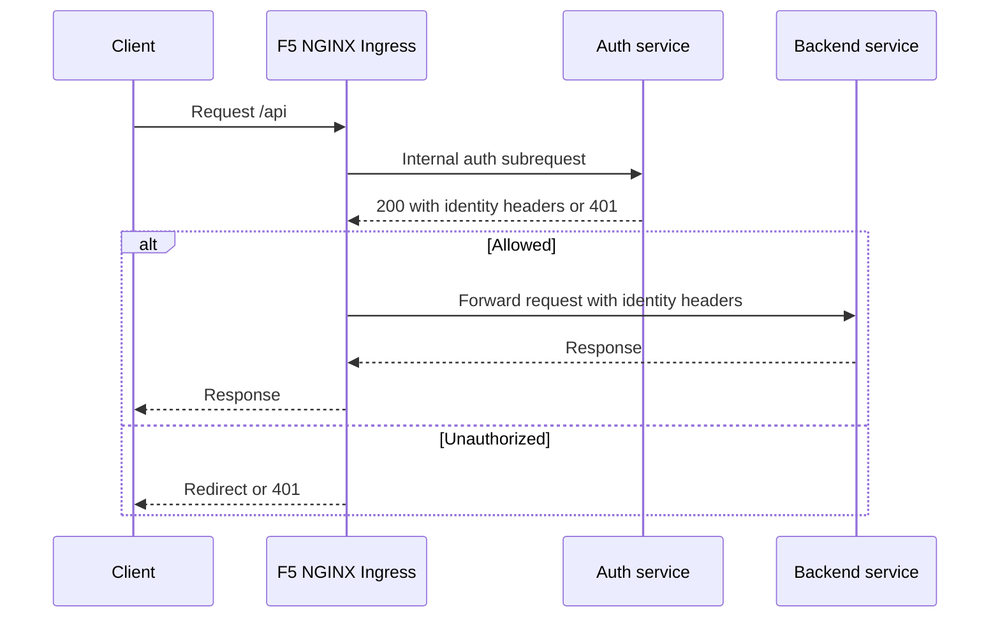

# F5 NGINX Auth Request Pattern

This page documents a public-safe authentication pattern using F5 NGINX Ingress Controller, mergeable ingress, and native NGINX `auth_request` behavior. It is written as an implementation reference for Kubernetes workloads that need centralized authentication before traffic reaches backend services.

## Architecture

| Component | Responsibility |
| --- | --- |
| Master ingress | Owns host-level configuration, TLS, and internal auth location snippets. |
| Minion ingress | Owns path routing and applies authentication behavior to selected backends. |
| Auth service | Validates the incoming request and returns identity headers for allowed users. |
| Backend service | Receives only authenticated traffic and trusted identity headers from NGINX. |



## Request Flow

1. A client sends a request to an application route.
2. F5 NGINX runs an internal `auth_request` subrequest.
3. The auth service validates the request using headers, cookies, or tokens.
4. If the auth service returns `200`, NGINX extracts identity headers and forwards the original request.
5. If the auth service returns `401`, NGINX redirects the user or returns an unauthorized response.

## Master Ingress Auth Location

The master ingress defines the internal authentication endpoint once for the host.

```yaml
apiVersion: networking.k8s.io/v1
kind: Ingress
metadata:
  name: app-master-ingress
  annotations:
    nginx.org/mergeable-ingress-type: "master"
    nginx.org/server-snippets: |
      location = /_external-auth {
        internal;

        if ($request_method = OPTIONS) {
          return 200;
        }

        proxy_pass https://auth.example.com/validate;
        proxy_method GET;
        proxy_pass_request_headers on;
        proxy_pass_request_body off;

        proxy_set_header Content-Length "";
        proxy_set_header Host auth.example.com;
        proxy_set_header Authorization $http_authorization;
        proxy_set_header Cookie $http_cookie;
        proxy_set_header X-Original-Host $host;
        proxy_set_header X-Original-URI $request_uri;
        proxy_set_header X-Original-Method $request_method;

        proxy_ssl_server_name on;
        proxy_ssl_name auth.example.com;
      }

      location @auth_error {
        return 302 https://auth.example.com/login;
      }
spec:
  ingressClassName: nginx
  rules:
    - host: app.example.com
```

## Minion Ingress Auth Enforcement

The minion ingress applies authentication only to the routes that need it.

```yaml
apiVersion: networking.k8s.io/v1
kind: Ingress
metadata:
  name: app-api-minion
  annotations:
    nginx.org/mergeable-ingress-type: "minion"
    nginx.org/location-snippets: |
      auth_request /_external-auth;
      error_page 401 = @auth_error;

      auth_request_set $auth_user_id $upstream_http_x_authenticated_user;
      auth_request_set $auth_user_role $upstream_http_x_authenticated_role;
      auth_request_set $auth_user_email $upstream_http_x_authenticated_email;

      proxy_set_header X-Authenticated-User $auth_user_id;
      proxy_set_header X-Authenticated-Role $auth_user_role;
      proxy_set_header X-Authenticated-Email $auth_user_email;
      proxy_set_header Authorization $http_authorization;
      proxy_set_header Cookie $http_cookie;
spec:
  ingressClassName: nginx
  rules:
    - host: app.example.com
      http:
        paths:
          - path: /api
            pathType: Prefix
            backend:
              service:
                name: app-service
                port:
                  number: 80
```

## Header Mapping

The auth service returns identity data as response headers.

```text
X-Authenticated-User: 12345
X-Authenticated-Role: admin
X-Authenticated-Email: user@example.com
```

NGINX exposes those response headers as `$upstream_http_*` variables. Hyphens in header names become underscores in NGINX variables, so `X-Authenticated-User` becomes `$upstream_http_x_authenticated_user`.

| Auth response header | NGINX upstream variable | Backend request header |
| --- | --- | --- |
| `X-Authenticated-User` | `$upstream_http_x_authenticated_user` | `X-Authenticated-User` |
| `X-Authenticated-Role` | `$upstream_http_x_authenticated_role` | `X-Authenticated-Role` |
| `X-Authenticated-Email` | `$upstream_http_x_authenticated_email` | `X-Authenticated-Email` |

## UI and API Split

For browser UI routes, a separate auth location can return redirects. For API routes, returning `401` or `403` is often cleaner because clients can handle the response directly.

```nginx
auth_request /_external-auth-ui;
```

Recommended pattern:

- Keep API and UI auth behavior separate.
- Avoid routing the auth subrequest through the same protected path.
- Pass the original host, URI, method, authorization header, and cookies to the auth service.
- Keep response headers consistent across services.

## Common Issues and Fixes

| Issue | Likely cause | Fix |
| --- | --- | --- |
| Auth loop | Auth endpoint routes through the protected app host. | Use a dedicated auth host or unprotected internal auth path. |
| Missing identity headers | Auth service does not return expected headers. | Check auth response with `curl -I` and verify `$upstream_http_*` names. |
| Redirect not happening | `error_page 401` target is missing or scoped incorrectly. | Define the redirect location in the master ingress server snippet. |
| NGINX reload failure | Invalid snippet, DNS name, or annotation. | Check controller logs immediately after applying the ingress. |
| CORS preflight blocked | Auth service receives `OPTIONS` requests unexpectedly. | Return `200` for preflight in the internal auth location. |

## Debugging Commands

```bash
kubectl get ingress
kubectl describe ingress app-master-ingress
kubectl describe ingress app-api-minion
kubectl logs -n nginx-ingress deploy/nginx-ingress
curl -I https://app.example.com/api/health
curl -I https://auth.example.com/validate
```

## Outcome

This pattern gives the platform team a reusable way to centralize authentication while keeping application services focused on business logic. It also demonstrates practical ingress knowledge: internal locations, subrequests, header propagation, redirect handling, and production debugging.
