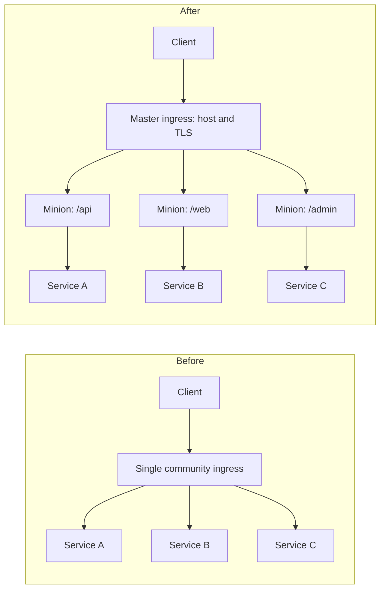

# Community NGINX to F5 NGINX Ingress Migration

This case study documents a Kubernetes ingress migration from the community NGINX Ingress Controller to F5 NGINX Ingress Controller. The goal was to improve routing ownership, reduce path conflicts, and make ingress behavior easier to operate across multiple services.

## Migration Summary

| Area | Before | After |
| --- | --- | --- |
| Ingress structure | Large ingress resources mixing host and path rules. | Mergeable master/minion ingress model. |
| Ownership | Shared changes in the same ingress object. | Host-level and path-level responsibilities separated. |
| Routing clarity | Wildcard paths and overlapping rules were harder to debug. | Each minion owns a clear path boundary. |
| Controller behavior | Community annotation model. | F5 NGINX annotations and enterprise routing controls. |
| Operations | Reload and routing failures required manual tracing. | Standard validation, annotations, and debugging flow. |

## Objectives

- Replace the community ingress controller with F5 NGINX Ingress Controller.
- Adopt the master/minion pattern for structured host and path ownership.
- Standardize annotations for timeouts, body size, buffers, rate limiting, and path handling.
- Reduce routing conflicts caused by mixed or wildcard ingress definitions.
- Improve the debugging path for production incidents.

## Architecture Change



## Installation Pattern

The controller was installed with the F5 NGINX OCI Helm chart.

```bash
helm install nginx-ingress oci://ghcr.io/nginx/charts/nginx-ingress --version 2.5.1
```

Basic validation:

```bash
kubectl get ingressclasses
kubectl get pods -n nginx-ingress
kubectl logs -n nginx-ingress deploy/nginx-ingress
```

## Master and Minion Model

The master ingress owns the shared host-level configuration.

```yaml
apiVersion: networking.k8s.io/v1
kind: Ingress
metadata:
  name: app-master
  annotations:
    nginx.org/mergeable-ingress-type: "master"
spec:
  ingressClassName: nginx
  rules:
    - host: app.example.com
```

Each minion ingress owns a path and backend service.

```yaml
apiVersion: networking.k8s.io/v1
kind: Ingress
metadata:
  name: app-api-minion
  annotations:
    nginx.org/mergeable-ingress-type: "minion"
    nginx.org/proxy-connect-timeout: "360s"
    nginx.org/proxy-read-timeout: "360s"
    nginx.org/proxy-send-timeout: "360s"
    nginx.org/client-max-body-size: "50m"
spec:
  ingressClassName: nginx
  rules:
    - host: app.example.com
      http:
        paths:
          - path: /api
            pathType: Prefix
            backend:
              service:
                name: api-service
                port:
                  number: 80
```

## F5 NGINX Annotation Standards

| Concern | Example annotation |
| --- | --- |
| Mergeable ingress | `nginx.org/mergeable-ingress-type: "master"` or `"minion"` |
| Timeout control | `nginx.org/proxy-read-timeout: "360s"` |
| Request size | `nginx.org/client-max-body-size: "50m"` |
| Buffer tuning | `nginx.org/proxy-buffer-size: "16k"` |
| Path behavior | `nginx.org/path-regex: "case_sensitive"` |
| Rate limiting | `nginx.org/limit-req-rate: "10r/s"` |
| Load balancing | `nginx.org/lb-method: "round_robin"` |
| SSL redirect | `nginx.org/ssl-redirect: "false"` |

## Validation Checklist

- Confirm the `IngressClass` exists and points to the F5 NGINX controller.
- Validate master and minion ingress resources are accepted by the controller.
- Check controller logs after each ingress change.
- Test host routing, path routing, TLS behavior, redirects, and expected status codes.
- Compare old and new controller behavior before switching traffic.
- Keep rollback manifests available during migration.

## Challenges Solved

| Challenge | Resolution |
| --- | --- |
| Path conflicts | Split path ownership into minion ingress resources. |
| Reload failures | Standardized annotations and validated controller logs during rollout. |
| Hard-to-debug routing | Introduced clear master/minion responsibility boundaries. |
| Wildcard behavior | Replaced broad rules with explicit path definitions. |

## Outcome

- Cleaner ingress ownership for teams and services.
- More predictable routing behavior under one host.
- Improved debugging because host-level and path-level concerns were separated.
- A reusable migration pattern for additional Kubernetes workloads.

## Related Deep Dive

See [F5 NGINX Auth Request Pattern](authentication.md) for the authentication design built on top of the master/minion ingress model.
